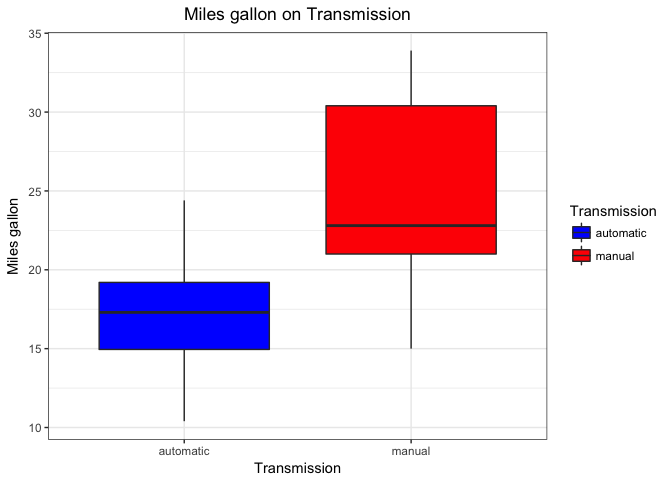
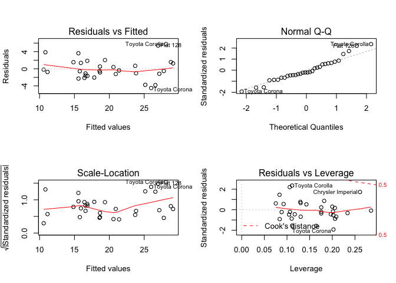

#### Executive Summary
My work for Motor Trend, a magazine about the automobile industry, is looking at a data set of a collection of cars, they are interested in exploring the relationship between a set of variables and miles per gallon (MPG) (outcome). They are particularly interested in the following two questions:

* “Is an automatic or manual transmission better for MPG”
* "Quantify the MPG difference between automatic and manual transmissions"

#### Conclusion 
If we only consider on variable transmission, the result shows that the manual transmission is better than automatic transmission for mpg. However, when we consider other confounding variables, such as cylinders, weight or displacement, a car with manual transmission is still better (0.1501 miles per galleon) but statistical non-significant than a car with automatic transmission. Based on this dataset, I cannot confidently conclude that which transmission is really better than another for mpg.
 

#### 1. Load data and summary the data

```r
library(datasets); library(ggplot2); data(mtcars); str(mtcars)   
```

```
## 'data.frame':	32 obs. of  11 variables:
##  $ mpg : num  21 21 22.8 21.4 18.7 18.1 14.3 24.4 22.8 19.2 ...
##  $ cyl : num  6 6 4 6 8 6 8 4 4 6 ...
##  $ disp: num  160 160 108 258 360 ...
##  $ hp  : num  110 110 93 110 175 105 245 62 95 123 ...
##  $ drat: num  3.9 3.9 3.85 3.08 3.15 2.76 3.21 3.69 3.92 3.92 ...
##  $ wt  : num  2.62 2.88 2.32 3.21 3.44 ...
##  $ qsec: num  16.5 17 18.6 19.4 17 ...
##  $ vs  : num  0 0 1 1 0 1 0 1 1 1 ...
##  $ am  : num  1 1 1 0 0 0 0 0 0 0 ...
##  $ gear: num  4 4 4 3 3 3 3 4 4 4 ...
##  $ carb: num  4 4 1 1 2 1 4 2 2 4 ...
```
* The data includes 32 observations and 11 variables: **mpg** - miles/(US) gallon, **cyl** - number of cylinders, **disp** - displacement (cu.in.), **hp** - gross horsepower, **drat** - rear axle ratio, **wt** - weight (lb/1000), **qsec** - ¼ mile time, **vs** - V/S, **am** - transmission (0 = automatic, 1 = manual), **gear** - number of forward gears, **carb** - number of carburetors

#### 2. Data Processing
Convert 'am' to factor and rename this data, and convert transmission, cylinders, transmission, gears and carburetors to factor as well (since they are not continious variables)


```r
mtcars$am<-factor(mtcars$am); levels(mtcars$am)<-c("automatic", "manual"); 
mtcars$cyl<-factor(mtcars$cyl); mtcars$gear<-factor(mtcars$gear); mtcars$carb<-factor(mtcars$carb)
```

#### 3. Hypothesis test to compare miles/gallon by transmissions
Assumption: there is no miles/gallon difference different between two transmissions.
Ho: mean(mpg):automatic = mean(mpg): manual

```r
t.test(mtcars$mpg[mtcars$am == "automatic"], mtcars$mpg[mtcars$am == "manual"])$p.value
```

```
## [1] 0.001373638
```
* The p-values 0.001373638 is amaller than 0.05, thus, the null hypothesis is rejected. With 95% confidence interval, there is statistical significant miles/gallon different between two transmissions. From their means and the plotin Appendix.1, these indicates that cars with manual transmission is better for mpg than cars with automatic transmission.

#### 4. Find confounding variables
First a pairs plot of all the variables is necessary to detect if there are any outliers that could influence the results and provide an intuition of the relationships between the variables.


```r
anova <- aov(mpg ~., data=mtcars); summary(anova)
```

```
##             Df Sum Sq Mean Sq F value   Pr(>F)    
## cyl          2  824.8   412.4  51.377 1.94e-07 ***
## disp         1   57.6    57.6   7.181   0.0171 *  
## hp           1   18.5    18.5   2.305   0.1497    
## drat         1   11.9    11.9   1.484   0.2419    
## wt           1   55.8    55.8   6.950   0.0187 *  
## qsec         1    1.5     1.5   0.190   0.6692    
## vs           1    0.3     0.3   0.038   0.8488    
## am           1   16.6    16.6   2.064   0.1714    
## gear         2    5.0     2.5   0.313   0.7361    
## carb         5   13.6     2.7   0.339   0.8814    
## Residuals   15  120.4     8.0                     
## ---
## Signif. codes:  0 '***' 0.001 '**' 0.01 '*' 0.05 '.' 0.1 ' ' 1
```
* It seems the variables cyl, disp and wt may also impact the mpg, since their p-values are smaller than 0.05. 

#### 5. Model Selection 
Add one possible confounding variable at a time into model and check if it result in significant effect.

```r
M1 <- lm(formula = mpg ~ am,        data=mtcars)
M2 <- lm(formula = mpg ~ am + wt,   data=mtcars); anova(M1, M2)
```

```
## Analysis of Variance Table
## 
## Model 1: mpg ~ am
## Model 2: mpg ~ am + wt
##   Res.Df    RSS Df Sum of Sq      F    Pr(>F)    
## 1     30 720.90                                  
## 2     29 278.32  1    442.58 46.115 1.867e-07 ***
## ---
## Signif. codes:  0 '***' 0.001 '**' 0.01 '*' 0.05 '.' 0.1 ' ' 1
```

```r
M3 <- lm(formula = mpg ~ am + cyl,  data=mtcars); anova(M1, M3)
```

```
## Analysis of Variance Table
## 
## Model 1: mpg ~ am
## Model 2: mpg ~ am + cyl
##   Res.Df   RSS Df Sum of Sq      F   Pr(>F)    
## 1     30 720.9                                 
## 2     28 264.5  2     456.4 24.158 8.01e-07 ***
## ---
## Signif. codes:  0 '***' 0.001 '**' 0.01 '*' 0.05 '.' 0.1 ' ' 1
```

```r
M4 <- lm(formula = mpg ~ am + disp, data=mtcars); anova(M1, M4)
```

```
## Analysis of Variance Table
## 
## Model 1: mpg ~ am
## Model 2: mpg ~ am + disp
##   Res.Df    RSS Df Sum of Sq      F    Pr(>F)    
## 1     30 720.90                                  
## 2     29 300.28  1    420.62 40.621 5.748e-07 ***
## ---
## Signif. codes:  0 '***' 0.001 '**' 0.01 '*' 0.05 '.' 0.1 ' ' 1
```

* Variable "cyl"" has the highest F-ratio and lowest p-value. The next significant variable is "wt". Let's check how "am + cyl + wt" fares, and then check "am + cyl + wt + disp" 


```r
M5 <- lm(formula = mpg ~ am + cyl + wt, data=mtcars); anova(M1, M3, M5)
```

```
## Analysis of Variance Table
## 
## Model 1: mpg ~ am
## Model 2: mpg ~ am + cyl
## Model 3: mpg ~ am + cyl + wt
##   Res.Df    RSS Df Sum of Sq      F    Pr(>F)    
## 1     30 720.90                                  
## 2     28 264.50  2    456.40 33.675 4.618e-08 ***
## 3     27 182.97  1     81.53 12.031  0.001771 ** 
## ---
## Signif. codes:  0 '***' 0.001 '**' 0.01 '*' 0.05 '.' 0.1 ' ' 1
```

```r
M6 <- lm(formula = mpg ~ am + cyl + wt + disp,  data=mtcars); anova(M1, M3, M5, M6)
```

```
## Analysis of Variance Table
## 
## Model 1: mpg ~ am
## Model 2: mpg ~ am + cyl
## Model 3: mpg ~ am + cyl + wt
## Model 4: mpg ~ am + cyl + wt + disp
##   Res.Df    RSS Df Sum of Sq       F    Pr(>F)    
## 1     30 720.90                                   
## 2     28 264.50  2    456.40 32.4451 8.589e-08 ***
## 3     27 182.97  1     81.53 11.5914   0.00216 ** 
## 4     26 182.87  1      0.10  0.0141   0.90647    
## ---
## Signif. codes:  0 '***' 0.001 '**' 0.01 '*' 0.05 '.' 0.1 ' ' 1
```
* Both variables "cyl"" and "wt"" are significant affecting mpg (P < 0.01), but "disp"" is not. 

#### 6. Discussion and summary the final model: Model 5 

```r
summary(M5)
```

```
## 
## Call:
## lm(formula = mpg ~ am + cyl + wt, data = mtcars)
## 
## Residuals:
##     Min      1Q  Median      3Q     Max 
## -4.4898 -1.3116 -0.5039  1.4162  5.7758 
## 
## Coefficients:
##             Estimate Std. Error t value Pr(>|t|)    
## (Intercept)  33.7536     2.8135  11.997  2.5e-12 ***
## ammanual      0.1501     1.3002   0.115  0.90895    
## cyl6         -4.2573     1.4112  -3.017  0.00551 ** 
## cyl8         -6.0791     1.6837  -3.611  0.00123 ** 
## wt           -3.1496     0.9080  -3.469  0.00177 ** 
## ---
## Signif. codes:  0 '***' 0.001 '**' 0.01 '*' 0.05 '.' 0.1 ' ' 1
## 
## Residual standard error: 2.603 on 27 degrees of freedom
## Multiple R-squared:  0.8375,	Adjusted R-squared:  0.8134 
## F-statistic: 34.79 on 4 and 27 DF,  p-value: 2.73e-10
```
* The resulting the final model (M5) mpg ~ am + cyl + wt is actually dependant on cylinders (cyl) and weight (wt), but maybe not transmission (am). The R-squared is pretty good to (0.8375). 
* To validate the model, I made a plot of the standardized residuals and its normal qq plot (Appendix.2). 


#### Appendix.1 Make a plot to look at the realtionship between "am" and "mpg" 
<!-- -->

* The plot shows that cars with manual transmission (higher mpg) seems more economic than cars with automatic transmission.

#### Appendix.2 Plot LM for predictors am, cyl and wt in final model (M5)


```r
par(mfrow = c(2,2))
plot(M5)
```

<!-- -->

* The 'Normal Q-Q' plot looks ok. The deviations from the straight line are minimal. The distribution of averages of the simulated samples is approximately normal as the actual quantiles match closely with the theoretical quantiles. This shows that our residuals are normally distributed.
